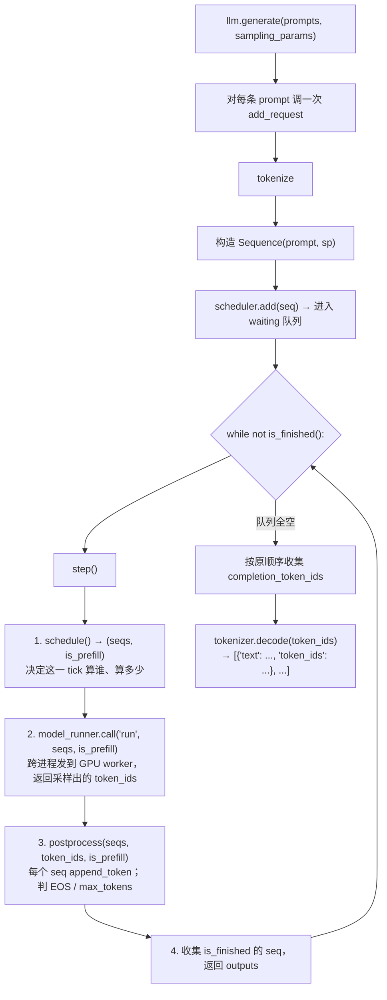
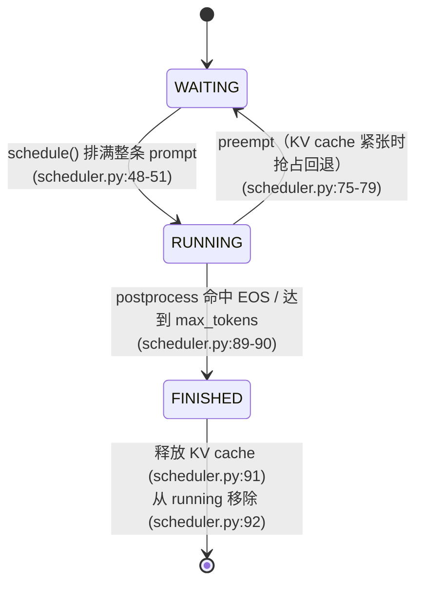

# 第 1 课：一个 request 从 `llm.generate` 到输出 token 的完整旅程

> **受众前提**：你懂 LLM 推理原理（prefill/decode、KV cache 这些概念不用再讲）、会读 Python（不必精通）、但**没接触过 vLLM / nano-vllm**。本课不假设你读过 vLLM 源码，所有 nano-vllm 特有的设计都会从头解释。

---

## §0 环境初始化

本课要真实跑一遍 nano-vllm（不靠 mock）。下面是一套**已在本机实测可用**的工序——按顺序执行即可。

### 0.1 确认前置条件

开始前确认这两条命令都能正常输出：

```bash
nvidia-smi        # 有一张 CUDA GPU；同时记下输出里的 CUDA Version: xx.x（下面选 cu index 用）
nvcc --version    # flash-attn 要从源码编译，需要 nvcc
```

`nvcc` 缺失时，先安装与本机 CUDA 驱动版本匹配的 CUDA toolkit。

### 0.2 装依赖

```bash
# 1. 建环境
uv venv
source .venv/bin/activate

# 2. 装 torch：按 nvidia-smi 的 CUDA Version 选对应 index（cu128 / cu124 / cu121 ...）
uv pip install torch --index-url https://download.pytorch.org/whl/cu128
python -c "import torch; print('cuda avail:', torch.cuda.is_available())"   # 期望 True

# 3. 编译并安装 flash-attn（需要 nvcc，约 10–20 分钟）
uv pip install ninja packaging
uv pip install flash-attn --no-build-isolation

# 4. 装其余依赖与本仓库（--no-deps 避免 torch 被重新解析）
uv pip install transformers xxhash
uv pip install -e . --no-deps
```

每步的预期产出：第 2 步末行打印 `cuda avail: True`；第 3、4 步静默成功（无报错）。

### 0.3 下模型

nano-vllm 默认用 Qwen3-0.6B 当 smoke 模型（小、快、能跑动）。提前下到本地：

```bash
huggingface-cli download Qwen/Qwen3-0.6B --local-dir ~/huggingface/Qwen3-0.6B
```

网络受限时配 `HF_ENDPOINT=https://hf-mirror.com` 走镜像。

### 0.4 Smoke：跑通 `example.py`

仓库根目录的 `example.py` 是最小入口——构造 2 条 prompt，喂给 `llm.generate`，打印补全。这是判断环境是否就绪的最快方式：

```bash
python example.py
```

看到两条 `Completion: '...'` 输出、且没有 traceback，环境就 OK 了。

> **运行配置提醒**：本课跑通只需默认的最小配置——`enforce_eager=True`、`tensor_parallel_size=1`。

---

## §1 学完你能

学完这节课，你应当能：

1. **说清一个 request 的全旅程**：从 `llm.generate(prompts, sampling_params)` 入口，到拿到一段文本输出，中间经历了 `add_request → [while not is_finished(): step()] → schedule → run → postprocess → decode` 哪些环节。
2. **看懂 `step()` 的三段式**（`llm_engine.py:49-55`）：`schedule()` 决定算什么、`model_runner.call("run", ...)` 真的去 GPU 上算、`postprocess()` 收尾。这是引擎每个 tick 的固定节奏。
3. **解释 `Sequence` 为什么是主进程 ↔ GPU worker 之间唯一的 IPC 载体**：引擎用 `torch.multiprocessing` 起了独立 worker 进程，主进程和 worker 之间只通过 `Sequence` 对象传消息，而 `Sequence.__getstate__/__setstate__`（`sequence.py:72-83`）决定了序列化时到底传什么（prefill 传整条 `token_ids`、decode 只传单个 `last_token`）。
4. **解释 `num_tokens` 的正负号双语义**（`llm_engine.py:51`）：同一个 `num_tokens` 变量，prefill 步取正值（=本步处理的 prompt token 总数），decode 步取负值（`-len(seqs)`），正负号被用来分流出「prefill 吞吐」和「decode 吞吐」两条曲线（`llm_engine.py:76-79`）。

---

## §2 全景图

### 2.1 整体数据流



**step 0 的 PREFILL** 会把本课 smoke 的两条 prompt 一起排进同一个 batch（`seqs = [seq_a, seq_b]`，`scheduler.py:30` 的 while 循环）；之后每个 DECODE tick 两条 seq 并行各产 1 个 token。`num_tokens` 在 prefill 步取 `Σ num_scheduled_tokens`（正值），decode 步取 `-len(seqs)`（负值）。

> **批 prefill（continuous batching 的雏形）**：本课 smoke 提交两条 prompt，它们会在**同一个 step 0 的 PREFILL**里一起算，之后也在同一个 DECODE tick 里并行各产 1 个 token——这正是你跑 lab 时看到 `step 0 PREFILL seqs=[...]` 里 `seqs` 含两条的原因。`schedule()` 的 prefill 分支是一个 `while` 循环（`scheduler.py:30`），只要 batch 预算（`max_num_batched_tokens`）和序列数上限（`max_num_seqs`）还够，就把 `waiting` 队列里的多条 prompt 一起拉进同一个 prefill step。这就是 continuous batching 的雏形：请求不必一个个排队算 prefill，而是能合并就合并。

### 2.2 Sequence 状态机

每个 request 被包成一个 `Sequence` 对象（`sequence.py:18-31`），它的 `status` 字段在三个态之间迁移（`sequence.py:8-11`）：



状态迁移的触发点：
- `WAITING → RUNNING`：`schedule()` 在 prefill 分支把整条 prompt 排满（`num_cached_tokens + num_scheduled_tokens == num_tokens`，`scheduler.py:48-51`）；初始 `status` 默认就是 `WAITING`（`sequence.py:20`）。
- `RUNNING → WAITING`：抢占（preempt）。KV cache 紧张时 `scheduler.py:75-79` 把 seq 释放、重回 waiting 队列。本课 smoke 量级触发不到。
- `RUNNING → FINISHED`：`postprocess` 里命中 EOS 或达到 `max_tokens`（`scheduler.py:89`→`90`）。之后释放 KV cache（`scheduler.py:91`）、从 `running` 移除（`scheduler.py:92`）。
- 进入 `RUNNING` 后每个 decode tick 固定 `num_scheduled_tokens = 1`（`scheduler.py:67`）。

`WAITING`：在等待 prefill（还没轮到算，或被抢占回退）；`RUNNING`：在 decode 循环里；`FINISHED`：生成结束。`scheduler.is_finished()`（`scheduler.py:19-20`）就是 `waiting` 和 `running` 两个队列都空了——所有 seq 都到了 `FINISHED` 并被移出队列。

---

## §3 逐段讲（带源码锚点）

### 3.1 `generate`：入口主循环（`llm_engine.py:60-90`）

`generate` 是用户唯一需要调的方法。它做三件事：把每条 prompt 经 `add_request` 灌进调度器、跑主循环 `while not is_finished(): step()`、最后按原顺序 decode 出文本。

```python
# llm_engine.py:69-70
for prompt, sp in zip(prompts, sampling_params):
    self.add_request(prompt, sp)
```

主循环里每个 tick 计时一次，并依据 `num_tokens` 正负号更新两条吞吐曲线：

```python
# llm_engine.py:75-79
output, num_tokens = self.step()
if num_tokens > 0:
    prefill_throughput = num_tokens / (perf_counter() - t)
else:
    decode_throughput = -num_tokens / (perf_counter() - t)
```

最后按 seq_id 排序、decode：

```python
# llm_engine.py:88-89
outputs = [outputs[seq_id] for seq_id in sorted(outputs.keys())]
outputs = [{"text": self.tokenizer.decode(token_ids), "token_ids": token_ids} for token_ids in outputs]
```

`seq_id` 来自一个**模块级全局自增计数器** `Sequence.counter = itertools.count()`（`sequence.py:16`），在进程生命周期内**从不重置**。因为创建越早的 seq 拿到的 id 越小，`sorted(outputs.keys())` 就能把结果按"提交顺序"还原出来。

> **说明**：seq_id 的**具体值不必从 0 开始**——它取决于这个进程在本次运行之前已经创建过多少个 Sequence。比如本课 lab 跑起来时，引擎/worker 初始化阶段可能就已经消耗掉若干个 id，所以你看到的可能是 `seq 4`、`seq 5` 而不是 `0`、`1`。这是全局自增计数器的正常现象（`sequence.py:16`），实现无误的判据是 id **单调递增**、`sorted` 能还原提交顺序。

### 3.2 `add_request`：prompt → Sequence（`llm_engine.py:43-47`）

```python
# llm_engine.py:43-47
def add_request(self, prompt: str | list[int], sampling_params: SamplingParams):
    if isinstance(prompt, str):
        prompt = self.tokenizer.encode(prompt)
    seq = Sequence(prompt, sampling_params)
    self.scheduler.add(seq)
```

`prompt` 既可以是字符串（这里 encode 成 token id 列表），也可以直接是已经 tokenize 好的 `list[int]`。然后包成一个 `Sequence` 丢进调度器的 `waiting` 队列。

`Sequence.__init__`（`sequence.py:18-31`）里几个关键字段先认清，后面处处用到：

```python
# sequence.py:18-31（节选）
self.token_ids = copy(token_ids)        # 会一路增长：prompt + 逐个 append 的补全 token
self.last_token = token_ids[-1]         # 最后一个 token，decode 步只传它
self.num_tokens = len(self.token_ids)   # 当前总长（prompt + completion）
self.num_prompt_tokens = len(token_ids) # prompt 长度，固定不变，用来切分 prompt/completion
self.num_cached_tokens = 0              # 已经算过、写进 KV cache 的 token 数
self.num_scheduled_tokens = 0           # 本次 tick 排进 batch 的 token 数
self.is_prefill = True                  # 还在 prefill 阶段？
```

> **给 vLLM 老手的提醒**（不熟 vLLM 可跳过）：nano-vllm 的 `Sequence` 把 vLLM 里的 `Sequence` + `SequenceGroup` 简化合成了一个——一个 request 就是一个 Sequence，没有 group / request_id 的二分。`num_completion_tokens`（`sequence.py:43-45`）就是 `num_tokens - num_prompt_tokens`，直接靠下标切分 `token_ids`。

### 3.3 `step()`：三段式 + `num_tokens` 正负号（`llm_engine.py:49-55`）

整个引擎的心脏就这 7 行：

```python
# llm_engine.py:49-55
def step(self):
    seqs, is_prefill = self.scheduler.schedule()                                  # 1. 决策
    num_tokens = sum(seq.num_scheduled_tokens for seq in seqs) if is_prefill else -len(seqs)  # 2. 算 num_tokens
    token_ids = self.model_runner.call("run", seqs, is_prefill)                  # 3. 跑 GPU
    self.scheduler.postprocess(seqs, token_ids, is_prefill)                       # 4. 收尾
    outputs = [(seq.seq_id, seq.completion_token_ids) for seq in seqs if seq.is_finished]  # 5. 收已完成的
    return outputs, num_tokens
```

**第 1 段 `schedule()`**：决定这一 tick 算哪些 seq、每个算多少 token。返回 `(seqs, is_prefill)`——本 tick 是 prefill 还是 decode 由这次调度的结果说了算（详见 §3.5）。

**第 2 段 `num_tokens` 的正负号**（`llm_engine.py:51`，这是关键）：

```python
num_tokens = sum(seq.num_scheduled_tokens for seq in seqs) if is_prefill else -len(seqs)
```

- **prefill 步**：`num_tokens = Σ num_scheduled_tokens`，是个**正数**，代表本步实际喂给模型的 prompt token 总数。
- **decode 步**：`num_tokens = -len(seqs)`，是个**负数**，绝对值 = 本步并行 decode 的序列数。

正负号纯粹是个「分流信号」——主循环（`llm_engine.py:76-79`）据此把这一 tick 的吞吐分别累进 `prefill_throughput` 或 `decode_throughput` 两条曲线，在 tqdm 进度条上同时显示。**同一个变量，prefill 和 decode 的物理含义完全不同**（一个是 token 数，一个是序列数），用符号位编码，省一个返回值。

**第 3 段 `model_runner.call("run", ...)`**：跨进程把 `seqs` 发给 GPU worker（主进程自己其实也跑一个 worker，见 §3.4），worker 算完返回每个 seq 采样出的一个 token id（`token_ids` 和 `seqs` 等长、一一对应）。

**第 4 段 `postprocess`**：见 §3.6。

**第 5 段**：把这次 tick 里 status 变成 `FINISHED` 的 seq 收集出来，连同它的 `completion_token_ids` 返回给 `generate`。

### 3.4 IPC：`Sequence` 是主进程 ↔ worker 的唯一信封（`sequence.py:72-83`）

`LlmEngine.__init__`（`llm_engine.py:24-31`）里用 `torch.multiprocessing.get_context("spawn")` 起 worker 进程（TP>1 时多个）。主进程和 worker 之间传递的就只有 `Sequence` 对象，所以 `Sequence` 的序列化协议就是两者的「信封格式」，定义在 `__getstate__/__setstate__`：

```python
# sequence.py:72-83
def __getstate__(self):
    last_state = self.last_token if not self.is_prefill else self.token_ids
    return (self.num_tokens, self.num_prompt_tokens, self.num_cached_tokens,
            self.num_scheduled_tokens, self.block_table, last_state)

def __setstate__(self, state):
    self.num_tokens, self.num_prompt_tokens, self.num_cached_tokens, \
        self.num_scheduled_tokens, self.block_table, last_state = state
    if isinstance(last_state, list):
        self.token_ids = last_state
        self.last_token = self.token_ids[-1]
    else:
        self.token_ids = []
        self.last_token = last_state
```

关键在 `last_state` 这一项分两种情况：

- **prefill 阶段**（`is_prefill=True`）：`last_state = self.token_ids`——**整条 prompt 都传过去**。因为 prefill 要对完整 prompt 做注意力，worker 必须拿到全部 token。
- **decode 阶段**（`is_prefill=False`）：`last_state = self.last_token`——**只传最后一个 token**。decode 步只需要新 token + 之前算好的 KV cache，整条历史已经在 cache 里了，不用再传。

这是 nano-vllm IPC 的核心优化：decode 步的跨进程消息大小从 O(seq_len) 降到 O(1)。`__setstate__` 里反序列化时，decode 态会先把 `self.token_ids` 清空（`sequence.py:82`），worker 拿到的是个「只有 `last_token` 的轻量 Sequence」，算完即弃。

### 3.5 `schedule()`：prefill 排整条 prompt，decode 排 1 个 token

`schedule()`（`scheduler.py:25-73`）先尝试 prefill（从 `waiting` 队列拉），排不到再 decode（从 `running` 队列拉）。两段的 `num_scheduled_tokens` 赋值是对比重点：

```python
# scheduler.py:46（prefill 分支内）
seq.num_scheduled_tokens = min(num_tokens, remaining)
```

prefill 时，一个 seq 的 `num_scheduled_tokens` 是「这条 prompt 还剩多少没算」和「batch 预算还剩多少」的较小值。当预算够、整条 prompt 一次算完时（`num_cached_tokens + num_scheduled_tokens == num_tokens`），seq 状态转 `RUNNING`（`scheduler.py:48-51`）。

```python
# scheduler.py:67（decode 分支内）
seq.num_scheduled_tokens = 1
```

decode 时，每个 seq 固定只算 **1 个 token**——就是上一步刚采样出来的那个 `last_token`。

> **对比**：prefill 的 `num_scheduled_tokens` = 整条 prompt 长度（算力密集、单条吃满算力）；decode 的 `num_scheduled_tokens` = 1（访存密集、靠 batch 多条来填算力）。这就是为什么两类 step 的吞吐特性完全不同、要分成两条曲线显示。

### 3.6 `postprocess`：收尾、`append_token`、判结束（`scheduler.py:81-92`）

本课的核心不变式就藏在这段代码里：

```python
# scheduler.py:81-92
def postprocess(self, seqs, token_ids, is_prefill):
    for seq, token_id in zip(seqs, token_ids):
        self.block_manager.hash_blocks(seq)          # 给 KV block 打 hash，供后续请求做 prefix cache 命中
        seq.num_cached_tokens += seq.num_scheduled_tokens   # 已算进 cache 的 token 数 += 本次排的
        seq.num_scheduled_tokens = 0                          # 清零，下一 tick 重新排
        if is_prefill and seq.num_cached_tokens < seq.num_tokens:   # 86: chunked prefill 还没算完
            continue                                                # 87: 跳过 append_token
        seq.append_token(token_id)                                  # 88: 把这一步采样出的 token append 进去
        if (not seq.ignore_eos and token_id == self.eos) \
           or seq.num_completion_tokens == seq.max_tokens:         # 89: 命中 EOS 或到 max_tokens
            seq.status = SequenceStatus.FINISHED                   # 90
            self.block_manager.deallocate(seq)                     # 91
            self.running.remove(seq)                               # 92
```

#### 要点：prefill 步本身就会产出第 1 个 completion token

注意第 86 行的 `continue`：

```python
if is_prefill and seq.num_cached_tokens < seq.num_tokens:
    continue
```

这个 `continue` **只在「chunked prefill 还没算完整条 prompt」时**才触发——即 `num_cached_tokens < num_tokens`，说明这条 prompt 太长、被切成多块，当前这块算完但整条 prompt 还没算完，所以还不能 append token。

**但当 prompt 一次算完时**（本课 smoke 的常见情况：`num_cached_tokens == num_tokens`），这个条件**不成立**，`continue` **不触发**，于是第 88 行 `seq.append_token(token_id)` **照跑**。

也就是说：**prefill 那一步不仅算了 prompt，还顺手采样出了第 1 个补全 token，并 append 进了 `token_ids`**。

由此推出本课最重要的一条不变式（lab 的 Task 3 就是在验证它）：

> **每参与一个 engine step，一个 Sequence 就 append 恰好一个 token。**
> prefill 步 append 第 1 个；之后每个 decode 步各 append 一个。
> 所以：`total_steps == num_completion_tokens`。

**桥接到多条 seq 共享一个 prefill step 的情况**：这条不变式是**按序列各自计**的。即使两条 seq 共享了 step 0 的 PREFILL（`scheduler.py:30` 的 `while` 把它们拉进同一 batch），每条 seq 参与的步数 = **它在 trace 的 `before` 里出现的次数**——那个共享的 prefill step 对每条 seq 都各算一次参与，每个 decode step 同理。所以每条 seq 的"参与步数"仍然等于它自己的 `num_completion_tokens`：它加入的每一步，`append_token` 都为它执行一次（prefill 步吐第 1 个，decode 步各吐 1 个）。不变式在 batched 情形下不变，变的只是"多条 seq 在同一 tick 里一起算"。

对照看：
- prefill 步：`num_scheduled_tokens = 整条 prompt 长度`，但 `append_token` 只跑一次 → 贡献 1 个 completion token。
- 每个 decode 步：`num_scheduled_tokens = 1`，`append_token` 跑一次 → 贡献 1 个 completion token。

两种 step 的「输入 token 数」差很多（prompt 长度 vs 1），但「输出（append）token 数」都是 1。这正是 lab 里 `Task1 total_steps==num_completion_tokens` 这条 check 的依据。

### 3.7 三态机的代码位置回顾

| 状态 | 进入处的代码 |
|---|---|
| `WAITING` | `sequence.py:20`（`__init__` 默认）、`scheduler.py:76`（preempt 回退） |
| `RUNNING` | `scheduler.py:49`（prefill 排满整条 prompt 后转入） |
| `FINISHED` | `scheduler.py:90`（postprocess 里命中 EOS/max_tokens） |

状态枚举定义在 `sequence.py:8-11`：

```python
# sequence.py:8-11
class SequenceStatus(Enum):
    WAITING = auto()
    RUNNING = auto()
    FINISHED = auto()
```

> **顺带认识 `seq.is_finished`**（`sequence.py:39-41`）：它是 `Sequence` 上的一个 property，就一行——`return self.status == SequenceStatus.FINISHED`。lab 的 Task 1 要你在 trace 的 `after` 里记下它（每个 seq 出 `postprocess` 后是否已结束）；`step()` 的第 5 段（§3.3）也正是用它把本次 tick 里刚结束的 seq 挑出来返回。

---

## §4 进 lab

本课的 lab 文件是 `course/lessons/lesson1/lab.py`。它做的事：**在不改任何 `nanovllm/` 源码的前提下，给 `Scheduler.postprocess` 和 `Scheduler.add` 挂钩子（monkey-patch），把每个 engine step 的关键状态录进一个 `_trace` 列表，再跑几条不变式 check**。

lab 里有 **两个 TODO**（Task 2 不写代码，是观察+解释）。按下面的顺序完成三个 Task：

### Task 1：填 `traced_postprocess`（`lab.py:50-63`，`def` 在第 50 行）

**输入**：`(self, seqs, token_ids, is_prefill)`——`seqs` 是本 step 参与的 Sequence 列表，`token_ids` 是本 step 刚采样出的 token（与 `seqs` 等长、一一对应），`is_prefill` 标记本步是 prefill 还是 decode。

**要做的事**：把本 step 记录成一条 dict 追加到全局 `_trace`，然后调用原始实现 `_orig_postprocess(self, seqs, token_ids, is_prefill)` 并 `return` 它的返回值。建议的记录结构：

```python
def traced_postprocess(self, seqs, token_ids, is_prefill):
    """TODO(student) — Task 1 (trace)：把本步记进 _trace，再调用
    原始实现 _orig_postprocess(self, seqs, token_ids, is_prefill)。

    必须在调用原始实现之前抓取每条 seq 的 num_scheduled_tokens
    （postprocess 会在 scheduler.py:85 把它清零）。建议的记录结构：
        {"is_prefill": is_prefill,
         "before": [(s.seq_id, s.num_scheduled_tokens, s.status.name), ...],
         "token_ids": list(token_ids),
         "after":   [(s.seq_id, s.status.name, s.is_finished), ...]}
    """
```

**输出**：钩子的返回值（原样透传原始 `postprocess` 的返回值）；副作用是向 `_trace` 追加一条 dict。

**要点（顺序敏感）**：`num_scheduled_tokens` 必须在调用原始 `postprocess` **之前**抓——因为 `scheduler.py:85` 会把它清零。把这个值连同 `seq_id`、`status` 一起存进 `before`；原始 `postprocess` 跑完后再把更新后的 `status` / `is_finished` 存进 `after`。这一步记录的 trace 是 Task 2、Task 3 的数据源。

### Task 3：填 `summarize_request`（`lab.py:64-70`，`def` 在第 64 行）

**输入**：一个 `seq`（`Sequence` 对象）。

**要做的事**：返回三元组 `(num_prompt_tokens, num_completion_tokens, total_steps)`。前两个直接从 `seq` 的 property 取（`num_prompt_tokens`、`num_completion_tokens`，见 `sequence.py:43-45`）；`total_steps` 要去 `_trace` 里数这个 `seq_id` 出现了几次（每个 step 的 `before` 里有 `seq_id`）。

```python
def summarize_request(seq):
    """TODO(student) — Task 3 (小封装)：返回
    (num_prompt_tokens, num_completion_tokens, total_steps)。

    total_steps = 这个 seq 参与过的 engine step 数（在 _trace 里数）。
    """
```

**输出**：三元组 `(num_prompt_tokens, num_completion_tokens, total_steps)`。`total_steps` 应该 == `num_completion_tokens`——这就是 §3.6 那条不变式（每参与一步就 append 一个 token）。

### Task 2：读 trace、写解释（无代码）

Task 1、Task 3 填完后，lab 跑完会打印整个 `_trace`（`_print_trace()`，`lab.py:147-154`）。Task 2 要求你看着 trace 做**观察 + 解释**两件事：

- **观察（Observe，已由 `run_checks` 自动验证，不必再答）**：你的 trace 里两条 prompt 是在**同一个 step 0 PREFILL** 里一起算的；prefill 步每条 seq 的 `num_scheduled_tokens` 等于它各自的 prompt 长度；之后每个 DECODE 步每条 seq 的 `num_scheduled_tokens` 都是 1。`run_checks` 里的 `Task2 prefill nst==num_prompt_tokens`、`Task2 decode nst all==1` 这两条就是机器帮你核对的。

- **解释（Explain，自检——对照 `ANSWERS.md §2`，`run_checks` 不判这一项）**：用你自己的话讲清楚——为什么每条 request 的**参与步数 `total_steps` 正好等于它的 `num_completion_tokens`**？提示见 §3.6 的不变式：关键在于 **prefill 步本身也会吐出第 1 个 completion token**（`scheduler.py:86-88` 的 `continue` 在"整条 prompt 一次算完"时不触发，于是 `append_token` 照跑），所以它参与的每一步都恰好 append 一个 token。

> **说明（Explain 的判定方式）**：`run_checks` 能验证"trace 里的数值确实满足不变式"，但不判定你的因果表述。Explain 这一项由你**对照 `ANSWERS.md §2` 的参考解释自检**——`run_checks` 的结果里不含此项。

请把你的解释直接写在 `lab.py` 里 `=== Task 2 (observe + explain) ===` 那块注释里（位置在 `traced_add` 之后、`traced_postprocess` 之前）。

### 验证：确认你做对了

填完两个 TODO 后，运行：

```bash
uv run python course/lessons/lesson1/lab.py
```

lab 会先 `_check_env`（`lab.py:128-145`）确认 torch / flash_attn / 模型目录都就绪，然后挂上钩子跑真实推理、打印 trace、打印 per-request summary、最后跑 `run_checks` 的 8 条断言。

**全部通过时最后一行是**：

```
All checks passed ✓
```

看到这行，即说明 Task 1、Task 3 实现正确（Task 2 不由它判定）。有 FAIL 会打印哪条挂了、并以 `SystemExit(1)` 退出。

---

## §5 图示补充

### 5.1 step 时序：两条 request 并行的一生

nano-vllm 把**两条 prompt 的 prefill 合并在同一个 step 0**（`scheduler.py:30` 的 `while` 循环），之后两条 seq 也在同一个 DECODE tick 里并行各产 1 个 token。下表以两条 seq（A、B，prompt 长度各为 Na、Nb，同步在 max_tokens=4 结束）为例：

| tick | is_prefill | 动作 | append? |
|------|------------|------|---------|
| 0 | PREFILL | `schedule`: seqs=[A,B] 一起排进 batch（nst=Na, Nb）；`run`: 一次算完两条 prompt + 各采样 1 个 token；`postprocess`: 两条都转 RUNNING | 各 append 第 1 个 completion token（`num_cached==num_tokens`，两条 continue 都不触发） |
| 1 | DECODE | `schedule`: nst=1 (A,B)；`run`: 各用 last_token + KV cache 采样 | 各 append 第 2 个 |
| 2 | DECODE | `schedule`: nst=1 (A,B) | 各 append 第 3 个 |
| 3 | DECODE | `schedule`: nst=1 (A,B) | 各 append 第 4 个 == max_tokens → 两条 FINISHED |

每条 seq 的总步数 = 4 == 各自的 `num_completion_tokens`。注意 tick 0（prefill）就已经为每条 seq append 了——这是 §3.6 的关键点。两条 seq 共享所有 4 个 tick，但不变式是**按 seq 各自计**的（见 §3.6 的桥接说明）。

### 5.2 prefill vs decode：`num_scheduled_tokens` 对比

| 维度 | prefill step | decode step |
|------|--------------|-------------|
| 来源 | `scheduler.py:46` | `scheduler.py:67` |
| 取值 | `min(num_tokens, remaining)`（整条 prompt 长度） | 固定 1 |
| 物理含义 | 本步喂给模型的 prompt token 总数（算整条 prompt） | 本步喂给模型的新 token（上一轮采样出的那个） |
| 算力特性 | 算力密集（matmul 大） | 访存密集（要读全 KV cache） |
| `num_tokens` 符号（`llm_engine.py:51`） | 取正（`Σ num_scheduled_tokens`）→ prefill_throughput | 取负（`-len(seqs)`）→ decode_throughput |

两种 step 在同一个 `step()` 函数里走同一条三段式流水线，但 `num_scheduled_tokens` 差着数量级——这就是为什么 LLM 推理服务要把 prefill 和 decode 分开调度、分开报吞吐的根本原因。

---

> **下一步**：第 2 课会钻进 `model_runner.call("run", ...)` 那一层，看 worker 进程内部怎么把一组 Sequence 真正变成一次 GPU 前向。本课只需理解到「主进程靠 step() 三段式驱动，Sequence 是跨进程信封」这一层即可。
