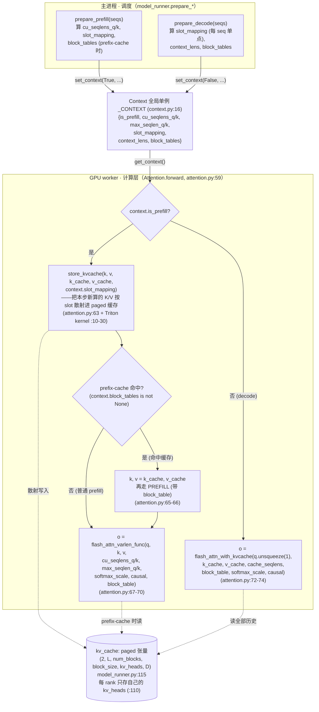

# 第 2 课：KV 缓存的接口与物理形态——从 flash-attention 调用到 paged 张量

> **一句话目标**：把 nano-vllm 里 KV cache 的两个面向讲清楚——对上是 flash-attention 在 prefill/decode 两个阶段的**调用契约**，对下是 paged 张量 `(2, L, num_blocks, block_size, kv_heads, D)` 的**物理形态**。
>
> **受众前提**：你懂 LLM 推理原理（知道 prefill/decode、KV cache 是什么、会算 attention），会读 Python，**没接触过 vLLM / nano-vllm**。本课**默认你已学完第 1 课**——`llm.generate → step() → schedule/run/postprocess` 三段式、`Sequence` 是跨进程信封这些不再重复。

---

## §0 环境初始化

本课环境与第 1 课**完全一致**，按 [`course/lessons/lesson1/TUTORIAL.md §0`](../lesson1/TUTORIAL.md) 走完即可（torch + flash-attn + nano-vllm `-e --no-deps` + Qwen3-0.6B 已下载到 `~/huggingface/Qwen3-0.6B/`）。**不在此重复**。

> **本课额外的运行配置**：第 1 课全程 `enforce_eager=True`。本课的 Q3b（观察 cudagraph 的 `-1` 哨兵）需要 **`enforce_eager=False`**——即让 LLM 在初始化时 `capture_cudagraph()`，否则 decode 永远走 eager 路径、graph 静态缓冲根本不会出现。lab 的 `--cudagraph` 子命令已经替你设好了这个开关；Task 1–4 仍用 `enforce_eager=True`。

---

## §1 学完你能

学完这节课，你应当能：

1. **说清 prefill/decode 两个 flash-attention 调用契约**：prefill 调 `flash_attn_varlen_func`（q/k/v 是 packed `(total, heads, D)`、无 padding、靠 `cu_seqlens_q/k` 切段）；decode 调 `flash_attn_with_kvcache`（q 要 `unsqueeze(1)` 注入 `seq_len=1` 维、KV 来自 paged cache、靠 `block_table` + `cache_seqlens` 定位）。
2. **亲手在 toy 输入上调这两个接口**：给定 2 条序列（长度 [3,2]、GQA `num_heads=4/num_kv_heads=1/head_dim=64`），逐参数拼出两个调用的 shape，并解释 prefill/decode 在 FA 用法上的差异。
3. **说清 paged 张量形态 + KV cache 容量反推**：缓存张量 `(2, L, num_blocks, block_size, kv_heads, D)` 里每个维度的含义；`num_kv_heads = num_key_value_heads // world_size`（TP 下每 rank 只存自己的 KV heads）；`num_kvcache_blocks` 由剩余显存反推（`total * gpu_memory_utilization - used - peak + current) // block_bytes`）。
4. **说清 `slot_mapping` 几何 + `store_kvcache` 哨兵 + cudagraph `-1` 哨兵**：prefill 的三段偏移几何（`block_id*block_size + 块内 offset`、首区间再 `+= start%block_size`、末区间按 token 数截断）、decode 的单点槽；Triton `store_kvcache_kernel` 里 `slot == -1` 直接 `return`；cudagraph 静态缓冲先 `fill_(-1)` 再覆盖 `[:bs]`，缺了哨兵会把 stale KV 散射进 slot 0。
5. **解释 `Context` 作为调度↔计算的解耦桥梁**：主进程的 `prepare_prefill/decode` 把 per-step 元数据（`cu_seqlens`/`slot_mapping`/`context_lens`/`block_tables` 等）写进全局单例 `_CONTEXT`，Attention 层在 forward 里 `get_context()` 取出来用——调度逻辑和计算 kernel 不直接耦合。

---

## §2 全景图

### 2.1 两条 FA 调用路径 + paged KV 张量 + Context 桥梁



**读图三件事**：

1. **Context 是桥梁**：主进程负责算元数据（`cu_seqlens`、`slot_mapping`、`block_tables`…），写进全局 `_CONTEXT`（`context.py:16`）；Attention 层在 forward 开头 `get_context()`（`attention.py:60`）取出来。调度（CPU 主进程）和计算（GPU kernel）之间**不传 q/k/v 之外的调度参数**，全靠这个单例解耦。
2. **prefill/decode 是两条不同的 FA 调用**：左路 prefill 调 `flash_attn_varlen_func`（packed q/k/v），右路 decode 调 `flash_attn_with_kvcache`（q `unsqueeze(1)`、KV 来自缓存）。两者**共享同一个 paged kv_cache 张量**。
3. **slot_mapping 是「散射坐标」**：`store_kvcache`（prefill 必走、decode 也走）按 `slot_mapping[idx]` 把本步算出的 K/V 第 `idx` 行**写进** paged 缓存（图里虚线「散射写入」）；decode 的 `flash_attn_with_kvcache` 则靠 `block_table` **读出**历史 KV（虚线「读全部历史」）。一个写、一个读，物理存储是同一块张量。

### 2.2 prefill/decode 在 FA 用法上的根本差异

| 维度 | prefill（`flash_attn_varlen_func`） | decode（`flash_attn_with_kvcache`） |
|------|-------------------------------------|-------------------------------------|
| q shape | `(total, num_heads, D)`——多条 prompt **packed**、无 padding | `(num_seqs, 1, num_heads, D)`——`unsqueeze(1)` 注入 `seq_len=1` 维 |
| K/V 来源 | 本步**新算的** K/V（`(total, kv_heads, D)`）；prefix-cache 命中时换成 `k_cache/v_cache` | **paged 缓存** `k_cache/v_cache`（不重算、不转发 K/V） |
| 序列边界 | `cu_seqlens_q` / `cu_seqlens_k`（packed 切段）+ `max_seqlen_q/k` | `cache_seqlens`（每条序列的有效 KV 长度）+ `block_table`（逻辑→物理块映射） |
| causal | `True`（每条 prompt 内部 mask） | `True`（单 query 对历史 KV） |
| 源码 | `attention.py:67-70` | `attention.py:72-74` |

> **为什么不同**：prefill 要对**一整条 prompt**算 attention（多 query、算力密集），用 packed varlen 避免 padding 浪费；decode 每步每序列只产**1 个新 query**、KV 全在缓存里（访存密集），直接让 FA 按 `block_table` 从 paged cache 读历史 KV。

---

## §3 逐段讲（带源码锚点）

### 3.1 `Attention.forward`：两条路径的分叉点（`attention.py:59-75`）

整个第 2 课的核心就这一个方法。它先写 KV 进缓存（prefill 和 decode 都写），再按 `is_prefill` 分流到两个 FA 接口：

```python
# attention.py:59-75
def forward(self, q: torch.Tensor, k: torch.Tensor, v: torch.Tensor):
    context = get_context()                                            # 60
    k_cache, v_cache = self.k_cache, self.v_cache                      # 61
    if k_cache.numel() and v_cache.numel():                            # 62
        store_kvcache(k, v, k_cache, v_cache, context.slot_mapping)    # 63
    if context.is_prefill:                                             # 64
        if context.block_tables is not None:    # prefix cache         # 65
            k, v = k_cache, v_cache                                    # 66
        o = flash_attn_varlen_func(q, k, v,                            # 67
                                   max_seqlen_q=context.max_seqlen_q, cu_seqlens_q=context.cu_seqlens_q,  # 68
                                   max_seqlen_k=context.max_seqlen_k, cu_seqlens_k=context.cu_seqlens_k,  # 69
                                   softmax_scale=self.scale, causal=True, block_table=context.block_tables)  # 70
    else:    # decode                                                  # 71
        o = flash_attn_with_kvcache(q.unsqueeze(1), k_cache, v_cache,  # 72
                                    cache_seqlens=context.context_lens, block_table=context.block_tables,   # 73
                                    softmax_scale=self.scale, causal=True)                                  # 74
    return o                                                           # 75
```

**逐行要点**：

- **`:62-63` 写缓存（两路都走）**：只要 `k_cache` 非空（即 `allocate_kv_cache` 已经挂上来），就调 `store_kvcache` 把本步刚算出的 K/V 按 `slot_mapping` 散射进 paged 缓存。**prefill 写整条 prompt 的 KV，decode 写单个新 token 的 KV**——见 §3.4。
- **`:64` 分流**：`is_prefill` 是唯一分叉信号，来自 `Context`（主进程 `prepare_prefill/decode` 设进去）。
- **`:65-66` prefix-cache 命中分支**：普通 prefill 时 `block_tables is None`，K/V 用本步新算的；**当某条 prompt 的前缀已经在缓存里**（前缀缓存命中），主进程会把 `block_tables` 设成非 `None`，于是这里把 `k, v` **换成 `k_cache, v_cache`**，并随 `block_table=context.block_tables` 一起传给 `flash_attn_varlen_func`（`:70`），让 FA 直接从 paged cache 读历史 KV、跳过对已缓存 token 的重算。这是 L4 前缀缓存的伏笔，本课只需知道「命中时 K/V 换成缓存」。
- **`:67-70` prefill 调用**：参数全在下文 §3.3 worked example 里逐个展开。
- **`:72-74` decode 调用**：注意 `q.unsqueeze(1)`——给 q 注入一个 `seq_len=1` 维度（FA 的 kvcache 接口要求 query 有长度维）。`cache_seqlens=context.context_lens`（每条序列的有效 KV 长度）、`block_table=context.block_tables`（逻辑 token → 物理 block）。

> **Causal=True 在两路都开**：prefill 时对每条 prompt 内部做下三角 mask；decode 时单个 query 对历史 KV 实际上不加 mask 也行（query 只有一个），但接口要求传 `causal`，nano-vllm 统一传 `True`。

### 3.2 `Context`：调度↔计算的唯一信封（`context.py:5-27`）

`Context` 是一个 `@dataclass`，所有字段都是 per-step 的元数据。它把主进程算好的调度信息和 GPU 上的 Attention 层**解耦**——主进程不直接调 Attention，只往 `_CONTEXT` 里塞数据。

```python
# context.py:5-27
@dataclass(slots=True)                                   # 5
class Context:                                           # 6
    is_prefill: bool = False                             # 7
    cu_seqlens_q: torch.Tensor | None = None             # 8
    cu_seqlens_k: torch.Tensor | None = None             # 9
    max_seqlen_q: int = 0                                # 10
    max_seqlen_k: int = 0                                # 11
    slot_mapping: torch.Tensor | None = None             # 12
    context_lens: torch.Tensor | None = None             # 13
    block_tables: torch.Tensor | None = None             # 14
                                                         #
_CONTEXT = Context()                                     # 16

def get_context():                                       # 18
    return _CONTEXT

def set_context(is_prefill, cu_seqlens_q=None, ...):     # 21
    global _CONTEXT
    _CONTEXT = Context(is_prefill, ...)                  # 23

def reset_context():                                     # 25
    global _CONTEXT
    _CONTEXT = Context()                                 # 27
```

**字段对应关系**（这张表是 §3.3–§3.5 的索引）：

| 字段 | 谁设（model_runner.py） | 谁（attention.py） | 含义 |
|------|------------------------|---------------------|------|
| `is_prefill` | `prepare_prefill:169` / `prepare_decode:187` | `forward:64` | 分流信号 |
| `cu_seqlens_q/k` | `prepare_prefill:166-167` | `forward:68-69` | packed 序列的切段前缀和（prefill 专用） |
| `max_seqlen_q/k` | `prepare_prefill:147-148` | `forward:68-69` | packed 序列里的最大长度（FA 内部用） |
| `slot_mapping` | `prepare_prefill:168` / `prepare_decode:184` | `forward:63` (`store_kvcache`) | 每个 token → 物理槽的散射坐标 |
| `context_lens` | `prepare_decode:185` | `forward:73` (`cache_seqlens`) | 每条序列的有效 KV 长度（decode 专用） |
| `block_tables` | `prepare_prefill:163` / `prepare_decode:186` | `forward:70,73` | 逻辑 token → 物理 block 映射（prefix-cache + decode） |

每步算完，`run`（`model_runner.py:219`）调 `reset_context()` 清空，避免下一步误读。

### 3.3 §3 worked example：在 toy 输入上调两个 FA 接口

> 学生大多没直接调过 flash-attention 的 C 扩展接口。本节用一个**最小可复现**的 toy 例子，把两个调用契约的每个参数都摊开讲。**lab 的 Task 3 就是让你亲手写这两次调用**，所以这里是 Task 3 的前置教学。

**Toy 输入**：2 条序列，长度 `[3, 2]`，GQA（`num_heads=4, num_kv_heads=1, head_dim=64`）。`total = 3 + 2 = 5`。`softmax_scale = head_dim ** -0.5 = 64 ** -0.5`。

#### 3.3.1 prefill：`flash_attn_varlen_func`

先构造 packed 的 q/k/v（**多条 prompt 拼在一起、无 padding**）：

```python
import torch
num_heads, num_kv_heads, head_dim = 4, 1, 64
total = 5
q = torch.randn(total, num_heads,    head_dim)   # (5, 4, 64)
k = torch.randn(total, num_kv_heads, head_dim)   # (5, 1, 64)   GQA: kv_heads 少
v = torch.randn(total, num_kv_heads, head_dim)   # (5, 1, 64)
scale = head_dim ** -0.5
```

**关键参数**：`cu_seqlens_q` / `cu_seqlens_k` 是 packed 序列的**前缀和切段**。对长度 `[3, 2]` 的两条序列：

```
cu_seqlens_q = [0, 3, 5]   # 第 0 条占 q[0:3]，第 1 条占 q[3:5]
cu_seqlens_k = [0, 3, 5]   # 同上（普通 prefill 时 q/k 等长）
max_seqlen_q = max(3, 2) = 3
max_seqlen_k = 3
```

**完整调用**（对齐 `attention.py:67-70`）：

```python
prefill_out = flash_attn_varlen_func(
    q, k, v,
    cu_seqlens_q=torch.tensor([0, 3, 5], dtype=torch.int32),
    cu_seqlens_k=torch.tensor([0, 3, 5], dtype=torch.int32),
    max_seqlen_q=3,
    max_seqlen_k=3,
    softmax_scale=scale,
    causal=True,
)   # 输出 shape (5, 4, 64) —— 每个输入 token 对应一个输出
```

- **packed 含义**：q/k/v 的第 0 维是**所有序列拼起来的 token 总数**（这里是 5），不是 batch 维。`cu_seqlens_q=[0,3,5]` 告诉 FA「token 0–2 属于第 0 条、token 3–4 属于第 1 条」。
- **packed 的动机**：padded batched attention 要把 2 条长度不一的序列 pad 到 3，浪费算力。varlen 靠 `cu_seqlens` 切段，**没有 padding、token 紧密排列**，长序列多算、短序列少算——这就是 nano-vllm 选 varlen 的原因。
- **`block_table=None`（普通 prefill）**：本步的 K/V 就是 `k, v` 本身；只有 prefix-cache 命中时（`attention.py:65-66`）才换成 `k_cache/v_cache` 并传 `block_table`。

#### 3.3.2 decode：`flash_attn_with_kvcache`

decode 时每条序列**只产 1 个新 query**，KV 全部来自 paged 缓存。先把上面 prefill 算出的 K/V「假装」写进一个 paged cache（真实代码里是 `store_kvcache` 干的）：

```python
q_dec = torch.stack([q[2], q[4]])              # (2, 4, 64)  每条序列取最后一个 token 的 q
                                                #            （真实 decode 里 q 来自 last_token 前向）

# paged cache 布局：(num_blocks, block_size, num_kv_heads, head_dim)
# flash_attn_with_kvcache 要求 paged block size 整除 256（与 nano-vllm 的 block_size=256 一致）
k_cache = torch.zeros(2, 256, num_kv_heads, head_dim)   # 2 个 block、block_size=256（对齐真实 config.py:17）
v_cache = torch.zeros_like(k_cache)
k_cache[0, :3] = k[:3]    # 第 0 条的 3 个 token KV 进 block 0 的前 3 槽
k_cache[1, :2] = k[3:5]   # 第 1 条的 2 个 token KV 进 block 1 的前 2 槽
v_cache[0, :3] = v[:3]
v_cache[1, :2] = v[3:5]

block_table = torch.tensor([[0],     # 第 0 条序列的逻辑 token 在物理 block 0
                            [1]], dtype=torch.int32)    # 第 1 条 → block 1（flash-attn 要求 int32）
cache_seqlens = torch.tensor([3, 2], dtype=torch.int32) # 每条序列有效 KV 数（flash-attn 要求 int32）
```

**完整调用**（对齐 `attention.py:72-74`）：

```python
decode_out = flash_attn_with_kvcache(
    q_dec.unsqueeze(1),         # (2, 1, 4, 64) —— 注入 seq_len=1 维！
    k_cache, v_cache,           # paged 缓存（不传 k/v）
    cache_seqlens=cache_seqlens,  # 每条序列的有效 KV 长度
    block_table=block_table,      # 逻辑 token → 物理 block
    softmax_scale=scale,
    causal=True,
).squeeze(1)                    # 输出 (2, 1, 4, 64) → squeeze 回 (2, 4, 64)
```

#### 3.3.3 prefill vs decode 的四处差异（必记）

| # | prefill（varlen） | decode（kvcache） |
|---|-------------------|-------------------|
| ① q 维度 | `(total, H, D)`——packed，无 seq_len 维 | `(num_seqs, 1, H, D)`——**必须 `unsqueeze(1)` 注入 seq_len=1 维** |
| ② K/V 来源 | 本步**新算的** K/V（命中前缀缓存时换成 `k_cache/v_cache`） | **paged 缓存** `k_cache/v_cache`（不传 k/v） |
| ③ 序列边界 | `cu_seqlens_q/k`（packed 前缀和切段） | `cache_seqlens`（每条有效长度）+ `block_table`（逻辑→物理块） |
| ④ 输出语义 | 每个 prompt token 一个输出（`(total, H, D)`） | 每条序列一个输出（`(num_seqs, H, D)`，squeeze 后） |

> **验证一致性**：在 toy 例子上，decode 取的是每条序列的**最后一个 token** 的 query（`q[2]`、`q[4]`），它对全历史 KV 做 attention，理论上结果应该 == `prefill_out[2]` 和 `prefill_out[4]`（prefill 时最后一个 token 的输出就是对全历史的 attention 结果）。lab 的 `_verify_fa_calls`（`solution/lab_solved.py:88-102`）正是用 `torch.allclose(decode_out, torch.stack([prefill_out[2], prefill_out[4]]))` 来验证你 Task 3 调对了——**这是一个很好的自检**：如果 decode 的 `cache_seqlens` / `block_table` 填错，结果会对不上。

### 3.4 paged KV 张量 + `store_kvcache` 散射（`model_runner.py:103-121` + `attention.py:10-40`）

#### 3.4.1 paged 张量形态（`model_runner.py:115`）

KV cache 是一个**单一的 6 维张量**，所有层、所有 block、所有 KV head 共占一块连续显存：

```python
# model_runner.py:115
self.kv_cache = torch.empty(2, hf_config.num_hidden_layers, config.num_kvcache_blocks,
                            self.block_size, num_kv_heads, head_dim)
```

| 维度 | 含义 | 出处 |
|------|------|------|
| `2` | K 和 V 两份（`kv_cache[0]=K`, `kv_cache[1]=V`） | `:115` 第 0 维 |
| `L = num_hidden_layers` | 模型层数（每层一份独立 KV cache） | `hf_config.num_hidden_layers` |
| `num_kvcache_blocks` | 物理块数（由显存反推，见 §3.4.3） | `config.num_kvcache_blocks` |
| `block_size` | 每块的 token 数（默认 256，`config.py:17`） | `self.block_size` |
| `num_kv_heads` | **每 rank 的** KV head 数 | `:110` |
| `head_dim` | 每个 head 的维度 | `:111` |

#### 3.4.2 `num_kv_heads = num_key_value_heads // world_size`（`model_runner.py:110`）

```python
# model_runner.py:110
num_kv_heads = hf_config.num_key_value_heads // self.world_size
```

**TP 下每个 rank 只存自己的 KV head 分片**。Qwen3-0.6B 的 `num_key_value_heads=8`，单卡（`world_size=1`）时 `num_kv_heads=8`；若 `world_size=2`，每 rank 存 4 个 KV head。这是 L7 张量并行的关键正确性点——KV cache **按 kv_head 分片、rank 间不传输**。

#### 3.4.3 `num_kvcache_blocks` 由剩余显存反推（`model_runner.py:112-114`）

```python
# model_runner.py:112-114
block_bytes = 2 * hf_config.num_hidden_layers * self.block_size * num_kv_heads * head_dim * hf_config.dtype.itemsize   # 112
config.num_kvcache_blocks = int(total * config.gpu_memory_utilization - used - peak + current) // block_bytes          # 113
assert config.num_kvcache_blocks > 0                                                                                  # 114
```

- **`:112` `block_bytes`**：一个物理块（跨所有层、所有 KV head、K+V 两份）占的字节数。`2` 是 K/V、`num_hidden_layers` 是层数、`block_size` 是每块 token 数、`num_kv_heads*head_dim` 是每 token 每 KV head 的元素数、`dtype.itemsize` 是每元素字节数（bfloat16 = 2）。
- **`:113` 反推块数**：`(可用显存预算) // block_bytes`。预算 = `total * gpu_memory_utilization - used - peak + current`——`gpu_memory_utilization` 默认 `0.9`（`config.py:12`），`used/peak/current` 是模型权重 + warmup 占的显存。
- **`:114` assert**：块数必须 > 0，否则连一个块都分不出来（显存不够）。
- **写回 config**：`num_kvcache_blocks` 在 `Config` 里默认是 `-1`（`config.py:18`），这里**覆盖**成真实值；`Scheduler` 构造时会读这个值来初始化 `BlockManager`。它**不是**构造期可手动设的旋钮。

#### 3.4.4 挂到每层 Attention（`model_runner.py:116-121`）

```python
# model_runner.py:116-121
layer_id = 0
for module in self.model.modules():
    if hasattr(module, "k_cache") and hasattr(module, "v_cache"):
        module.k_cache = self.kv_cache[0, layer_id]   # 这层的 K 切片：(num_blocks, block_size, kv_heads, D)
        module.v_cache = self.kv_cache[1, layer_id]   # 这层的 V 切片
        layer_id += 1
```

每层 Attention 的 `__init__`（`attention.py:57`）把 `k_cache/v_cache` 初始化成空 tensor 占位；`allocate_kv_cache` 遍历所有模块，给有这两个属性的（即 Attention 层）赋上**对应层**的切片。于是 `Attention.forward`（`:61`）的 `self.k_cache` 就是 `(num_blocks, block_size, kv_heads, D)` 的 4 维视图。

#### 3.4.5 `store_kvcache` Triton kernel + `slot == -1` 哨兵（`attention.py:10-30`）

写缓存的 kernel 是个 Triton JIT。**每个 program 处理一个 token**，按 `slot_mapping[idx]` 把第 `idx` 个 token 的 K/V 一行散射进 paged 缓存：

```python
# attention.py:10-30
@triton.jit
def store_kvcache_kernel(key_ptr, key_stride, value_ptr, value_stride,
                         k_cache_ptr, v_cache_ptr, slot_mapping_ptr, D: tl.constexpr):
    idx = tl.program_id(0)                       # 21
    slot = tl.load(slot_mapping_ptr + idx)       # 22
    if slot == -1: return                        # 23  ← 哨兵！
    key_offsets = idx * key_stride + tl.arange(0, D)             # 24
    value_offsets = idx * value_stride + tl.arange(0, D)         # 25
    key = tl.load(key_ptr + key_offsets)                         # 26
    value = tl.load(value_ptr + value_offsets)                   # 27
    cache_offsets = slot * D + tl.arange(0, D)                   # 28
    tl.store(k_cache_ptr + cache_offsets, key)                   # 29
    tl.store(v_cache_ptr + cache_offsets, value)                 # 30
```

**`:23` `if slot == -1: return`** 是关键哨兵——遇到 `-1` 直接跳过这个 token，不写任何东西。它的用途见 §3.6（cudagraph 静态缓冲保护）。

**Launcher 的断言**（`attention.py:36-39`）保证布局正确：

```python
# attention.py:36-39
assert key.stride(-1) == 1 and value.stride(-1) == 1              # head_dim 维连续
assert key.stride(1) == head_dim and value.stride(1) == head_dim  # num_heads 维步长
assert k_cache.stride(1) == D and v_cache.stride(1) == D          # cache 第 1 维步长
assert slot_mapping.numel() == N                                  # slot 数 == token 数
```

### 3.5 `slot_mapping` 几何：prefill 三段偏移 vs decode 单点（`model_runner.py:129-188`）

`slot_mapping` 是**「逻辑 token → 物理槽」的散射坐标**。每个 token 的物理槽 = `block_id * block_size + 块内偏移`。prefill（多条 prompt packed）和 decode（每序列单 token）的几何完全不同。

#### 3.5.1 prefill：三段偏移循环（`model_runner.py:151-161`）

prefill 时一条 prompt 可能跨多个 block。`prepare_prefill` 对每条 seq 算它本次排的 token 落在哪些 block 里：

```python
# model_runner.py:151-161
start_block = start // self.block_size                                            # 151
end_block = (end + self.block_size - 1) // self.block_size                        # 152
for i in range(start_block, end_block):                                           # 153
    slot_start = seq.block_table[i] * self.block_size                             # 154
    if i == start_block:                                                          # 155
        slot_start += start % self.block_size                                     # 156  ← 首区间偏移
    if i != end_block - 1:                                                        # 157
        slot_end = seq.block_table[i] * self.block_size + self.block_size         # 158  ← 整块
    else:                                                                         # 159
        slot_end = seq.block_table[i] * self.block_size + end - i * self.block_size   # 160  ← 末区间截断
    slot_mapping.extend(range(slot_start, slot_end))                              # 161
```

其中 `start = seq.num_cached_tokens`、`end = start + seqlen_q`（`:139-141`）。

**三段几何**（lab Task 2 要复刻这段逻辑）：

| 区间 | `slot_start` | `slot_end` | 含义 |
|------|--------------|------------|------|
| 首区间（`i == start_block`） | `block_table[i]*block_size + start%block_size` | 整块（`+ block_size`）或末区间截断 | 第一个 block 可能从中间开始（`start` 不在块边界），所以 `+= start%block_size` |
| 中间整块 | `block_table[i]*block_size` | `block_table[i]*block_size + block_size` | 落满整块 |
| 末区间（`i == end_block-1`） | `block_table[i]*block_size` | `block_table[i]*block_size + end - i*block_size` | 最后一个 block 可能没填满，按 `end` 截断 |

**举例**：`block_size=256`，一条 prompt 长 600、`start=0`、`end=600`，`block_table=[5,6,7]`。
- 首区间 `i=0`：`slot_start = 5*256 + 0 = 1280`，`slot_end = 5*256+256 = 1536` → 槽 `[1280, 1536)`
- 中间 `i=1`：`[6*256, 6*256+256) = [1536, 1792)`
- 末区间 `i=2`：`slot_end = 7*256 + 600 - 2*256 = 1792 + 88 = 1880` → `[1792, 1880)`
- 共 256 + 256 + 88 = 600 个槽，正好等于 token 数。

#### 3.5.2 decode：每序列单点（`model_runner.py:181`）

decode 每条序列只排 1 个 token（L1 已讲），所以 slot 是**单点**：

```python
# model_runner.py:181
slot_mapping.append(seq.block_table[-1] * self.block_size + seq.last_block_num_tokens - 1)
```

新 token 落在**当前最后一个 block** 的**下一个空位**：`block_table[-1]` 是当前块 id，`last_block_num_tokens` 是这块已经用了几个槽（新 token 之前），`-1` 是因为 `last_block_num_tokens` 已经包含了刚 append 的这个 token（在 postprocess 之后）。所以新 token 的槽 = 当前块起点 + 已用槽数 - 1。

#### 3.5.3 prefix-cache 信号（`model_runner.py:162`）

```python
# model_runner.py:162
if cu_seqlens_k[-1] > cu_seqlens_q[-1]:    # prefix cache
    block_tables = self.prepare_block_tables(seqs)
```

prefill 时若 `cu_seqlens_k` 的总和 > `cu_seqlens_q` 的总和，说明 K 的 token 比 Q 多（Q 是本次新排的、K 包含已缓存的前缀），于是准备 `block_tables` 让 FA 从缓存读历史 KV——对应 `attention.py:65-66` 的命中分支。这是 L4 的内容，本课只需认得这个信号。

### 3.6 cudagraph `-1` 哨兵（`model_runner.py:197-212`）

cudagraph 要求输入张量**地址静态**（capture 后形状/指针不能变）。nano-vllm 用固定大小的静态缓冲（`graph_vars`，`model_runner.py:250-257`），每步把真实数据 copy 进去。问题：静态缓冲按最大 batch 预分配（`max_bs = min(max_num_seqs, 512)`，`:226`），但真实 batch 往往更小——**多出来的槽位怎么办？**

```python
# model_runner.py:206-207
graph_vars["slot_mapping"].fill_(-1)              # 206  先全填 -1
graph_vars["slot_mapping"][:bs] = context.slot_mapping   # 207  再覆盖前 bs 个真实槽
```

**先 `fill_(-1)` 再覆盖 `[:bs]`**：真实 batch 是 `bs`，缓冲里 `[bs:]` 那些位置全是 `-1`。结合 §3.4.5 的 `store_kvcache_kernel`（`:23` `if slot == -1: return`），这些 `-1` 槽位的 program 会**直接 return、不写任何东西**。

> **缺了哨兵会怎样**：如果不用 `-1` 填充、`[bs:]` 残留着上一步的 stale slot（或者初始化的 0），`store_kvcache` 会把这些幽灵 token 的 K/V **散射进 slot 0 或上一步的旧 slot**，污染缓存。这就是为什么 cudagraph 路径**必须**用 `-1` 哨兵占位。

`run_model` 的分流条件（`model_runner.py:197`）：

```python
# model_runner.py:197-198
if is_prefill or self.enforce_eager or input_ids.size(0) > 512:
    return self.model.compute_logits(self.model(input_ids, positions))
```

- **prefill 永远 eager**：prefill 的 batch 形状变化大（token 总数不固定），不适合 capture。
- **`enforce_eager=True`**：用户显式禁用 cudagraph（L1 全程这个）。
- **`input_ids.size(0) > 512`**：超过 `max_bs`，没有对应 bucket 的 graph。
- 其余（decode + `enforce_eager=False` + `bs <= 512`）走 `graph.replay()`（`:199-212`）。

graph bucket 的划分（`model_runner.py:234`）：`[1, 2, 4, 8] + range(16, max_bs+1, 16)`。实际 `bs` 向上取最近的 bucket（`:202`）。

---

## §4 进 lab

本课的 lab 文件是 `course/lessons/lesson2/lab.py`。它在**不改任何 `nanovllm/` 源码**的前提下，给 `Attention.forward` 和 `Scheduler.postprocess` 挂钩子（monkey-patch），录下每个 engine step 的 FA 调用形状，再跑几条不变式 check。lab 里有 **3 个 TODO**（Task 4 是 observe + explain，不写代码）。

### Task 1：填 `traced_attention_forward`（`lab.py`，`def traced_attention_forward`）

**输入**：`(self, q, k, v)`——`self` 是被 hook 的 `Attention` 模块，`q/k/v` 是本步该层收到的张量（prefill 时 packed `(total, H, D)`，decode 时 `(num_seqs, H, D)`）。

**要做的事**：把本步的 FA 调用形状记成一条 dict 追加到全局 `_trace`，然后调用原始实现 `_orig_attention_forward(self, q, k, v)` 并 `return` 它的返回值。

**关键点——只录 layer 0**：`Attention.forward` 每步每层都会触发一次（`num_hidden_layers` 次），但每层共享同一个 `Context`、q/k/v 形状也一样，所以**只录第 0 层**。用 `_layer_order.setdefault(id(self), len(_layer_order)) == 0` 判断「这个模块是不是第一次见、是不是 layer 0」。

**建议的记录结构**（字段对应 §3.2 的 Context 字段）：

```python
def traced_attention_forward(self, q, k, v):
    """TODO(student) — Task 1 (trace)：把本步的 FA 调用形状记进 _trace，再调用
    原始实现 _orig_attention_forward(self, q, k, v)。

    只录 layer 0（每层共享 context & shapes）：
        if _layer_order.setdefault(id(self), len(_layer_order)) == 0: ...
    通过 context = _get_context() 取 Context 单例（mirror attention.py:59-75 读的字段）。
    """
```

记录的 dict 至少包含：`is_prefill`、`q_shape/k_shape/v_shape`、prefill 时 `cu_seqlens_q/k` + `max_seqlen_q/k`、decode 时 `context_lens` + `block_tables` shape、以及 `slot_mapping`（两路都要）。这些字段是 Task 2/4 + `run_checks` 的数据源。

### Task 2：填 `prefill_slot_mapping`（`lab.py`，`def prefill_slot_mapping`）

**输入**：`(block_table, block_size, start, num_tokens)`——`block_table` 是这条 seq 的 block id 列表，`block_size=256`，`start` 是本次排的起始 token 索引，`num_tokens` 是本次排的 token 数。

**要做的事**：复刻 §3.5.1 的三段偏移循环（`model_runner.py:151-161`），返回一个长度为 `num_tokens` 的 list，每个元素是该 token 的物理槽 `block_id * block_size + 块内偏移`。

```python
def prefill_slot_mapping(block_table, block_size, start, num_tokens):
    """TODO(student) — Task 2：复刻 model_runner.py:151-161 的 prefill slot 散射。
    返回长度 num_tokens 的 list，每个元素 = block_id*block_size + 块内偏移。
    首区间起点再 += start%block_size；末区间按 end - i*block_size 截断。
    """
```

`run_checks` 会拿真实 prefill 录到的 `slot_mapping`、切出第一条 seq 的那段，和你的 `prefill_slot_mapping` 重建结果对比——**逐元素相等**才算过。

### Task 3：填 `simulate_fa_calls`（`lab.py`，`def simulate_fa_calls`）

**输入**：`(fa_varlen, fa_kvcache, device, dtype)`——`fa_varlen`/`fa_kvcache` 是 `main()` 传进来的**真实** `flash_attn.flash_attn_varlen_func` / `flash_attn_with_kvcache`（测试里是 mock）。你**只负责调它们**，不构造 mock。

**要做的事**：按 §3.3 worked example 的 toy 输入（2 seqs 长 [3,2]、GQA `num_heads=4/num_kv_heads=1/head_dim=64`）调两个接口，返回 `(prefill_out, decode_out)`。toy 输入的构造形（`q/k/v` 的 shape、`cu_seqlens`、cache 预填、`block_table`/`cache_seqlens` 的值与 **int32** dtype）已在 `lab.py` 里 `simulate_fa_calls` 的 docstring + §3.3 写全——你照着构造出这些张量，再填两处 `# TODO(student)` 标记的 FA 调用即可。**注意**：`block_table`/`cache_seqlens` 必须是 `torch.int32`（flash-attn 拒绝 int64）；调错参数时 `FAContractError` 会提示镜像 `attention.py` 的哪几行。

**关键**：对照 `attention.py:67-70`（prefill）和 `:72-74`（decode）的调用形状。prefill 传 `cu_seqlens_q/k=[0,3,5]`、`max_seqlen_q/k=3`；decode 传 `q_dec.unsqueeze(1)`、`cache_seqlens=[3,2]`、`block_table=[[0],[1]]`。两个调用都要包在 `try/except` 里：`FAContractError` 原样 raise，其他异常包成 `FAContractError("...mirror attention.py:67-70/72-74...")`。

`_verify_fa_calls`（lab 提供）会检查：prefill 输出 shape `(5,4,64)`、decode 输出 shape `(2,4,64)`、且 `decode_out ≈ torch.stack([prefill_out[2], prefill_out[4]])`（§3.3.3 的一致性）。

### Task 4：读 trace、写解释（无代码）

Task 1–3 填完后，lab 跑完会打印整个 `_trace`（`_print_trace()`）。Task 4 要求你**看着 trace 观察 + 解释**（`run_checks` 自动验证观察项，解释项对照 `ANSWERS.md` 自检）：

- **观察（Observe，`run_checks` 自动验证）**：prefill 步的 `q.shape` 是 packed `(total, H, D)`（非按 seq padding）、`cu_seqlens_q` 是 `[0, a, a+b]` 形式；decode 步的 `q.shape` 是 `(num_seqs, H, D)`。对应 `Task4 prefill cu_seqlens_q == [0,a,a+b]`、`Task4 decode q.shape is (num_seqs,H,D)` 两条 check。
- **解释（Explain，自检——对照 `ANSWERS.md`）**：用你自己的话讲清楚——(a) prefill 为什么用 packed varlen 而非 padded batched attention？(b) `flash_attn_with_kvcache` 的 `q.unsqueeze(1)`、`cache_seqlens`、`block_table` 各自的职责？(c) prefill vs decode 在 FA 用法上的四处差异（§3.3.3）？

### 验证：确认你做对了

填完 3 个 TODO 后，运行：

```bash
.venv/bin/python course/lessons/lesson2/lab.py
```

lab 会先 `_check_env` 确认 torch / flash_attn / 模型目录就绪，然后：① 在真实 flash_attn 上调 Task 3 的 `simulate_fa_calls`（GPU）、② 挂钩子跑真实推理（enforce_eager=True）打印 trace、③ 跑 `run_checks` 的若干断言。

**全部通过时最后一行是**：

```
All checks passed ✓
```

看到这行，即说明 Task 1（trace 录制）、Task 2（slot 几何）、Task 3（FA 调用）实现正确（Task 4 的观察项也由它验证；解释项自检）。

### Q3b：观察 cudagraph 的 `-1` 哨兵（额外 run）

Task 1–4 用的是 `enforce_eager=True`。要观察 §3.6 的 `-1` 哨兵，另跑一次（lab 用子进程避免重复初始化 NCCL）：

```bash
.venv/bin/python course/lessons/lesson2/lab.py --cudagraph
```

它会用 `enforce_eager=False` 起 LLM（触发 `capture_cudagraph`），decode 走 `graph.replay()`，然后打印 `graph_vars['slot_mapping']` 的内容：前 `bs` 个是真实槽、`[bs:]` 全是 `-1`。对照 §3.6 理解为什么静态缓冲必须用 `-1` 哨兵占位。

> 若你的 GPU 不支持 cudagraph capture，`main_cudagraph` 会捕获异常并打印一段「从源码解释」的 fallback（指向 `model_runner.py:206-207` + `attention.py:23`）——不影响主流程。

---

## §5 图示补充

### 5.1 prefill vs decode FA 调用参数对比

| 参数 | prefill（`flash_attn_varlen_func`） | decode（`flash_attn_with_kvcache`） |
|------|-------------------------------------|-------------------------------------|
| q | `(total, H, D)`——packed | `(num_seqs, 1, H, D)`——`q.unsqueeze(1)` |
| k / v | `(total, kv_heads, D)`（本步新算）；prefix-cache 命中时换成 `k_cache/v_cache` | 不传 k/v——直接传 `k_cache/v_cache`（paged 缓存） |
| 序列边界 | `cu_seqlens_q` / `cu_seqlens_k`（packed 前缀和切段） | `cache_seqlens`（每条有效 KV 长度） |
| 物理 block 映射 | `block_table`（仅 prefix-cache 命中时传，`attention.py:70`） | `block_table`（每次都传，`attention.py:73`） |
| `max_seqlen_q/k` | 必传（packed 里最长那条） | 不需要（query 长度固定 1） |
| `softmax_scale` | `self.scale`（`head_dim**-0.5`） | 同左 |
| `causal` | `True` | `True` |
| 源码 | `attention.py:67-70` | `attention.py:72-74` |

### 5.2 prefill `slot_mapping` 三段偏移几何（lab Task 2 速查）

设 `block_size=256`，某 seq 本次排 `start..end` 跨了 `start_block..end_block`：

| 区间 | `i` 取值 | `slot_start` | `slot_end` | 几何含义 |
|------|----------|--------------|------------|----------|
| 首 | `i == start_block` | `block_table[i]*256 + start%256` | `+256`（整块）或末区间截断 | 起点 `start` 不在块边界 → 加 `start%256` 偏移 |
| 中间 | `start_block < i < end_block-1` | `block_table[i]*256` | `block_table[i]*256 + 256` | 落满整块 |
| 末 | `i == end_block-1` | `block_table[i]*256` | `block_table[i]*256 + end - i*256` | 终点 `end` 不在块边界 → 按 `end` 截断 |

**总槽数** = `(end - start)` = 本次排的 token 数。decode 时退化为单点（§3.5.2）。

### 5.3 `-1` 哨兵的两处出现

| 位置 | 代码 | 谁写 `-1` | 谁读 `-1` | 作用 |
|------|------|-----------|-----------|------|
| `store_kvcache_kernel` | `attention.py:23` | （kernel 内读） | `if slot == -1: return` | 跳过哨兵槽位、不写任何东西 |
| cudagraph 静态缓冲填充 | `model_runner.py:206-207` | `slot_mapping.fill_(-1)` 然后 `[:bs]` 覆盖真实槽 | `store_kvcache_kernel`（上面那行） | 静态缓冲里 `[bs:]` 全填 `-1`，让 kernel 跳过幽灵 token，**避免把 stale KV 散射进 slot 0** |

两处配合：`model_runner` 用 `-1` 占位 → kernel 识别 `-1` 跳过。缺了任何一环，cudagraph 路径都会污染缓存。

---

> **下一步**：第 3 课会钻进 `Block` / `BlockManager` 抽象——看 `slot_mapping` 里的 `block_id` 是怎么分配/回收的、`Sequence.block_table` 是怎么维护的、prefix-cache 的 hash 是怎么打的。本课只需理解到「KV cache 是 paged 张量、FA 按 slot/block_table 读写、Context 解耦调度与计算」这一层。
